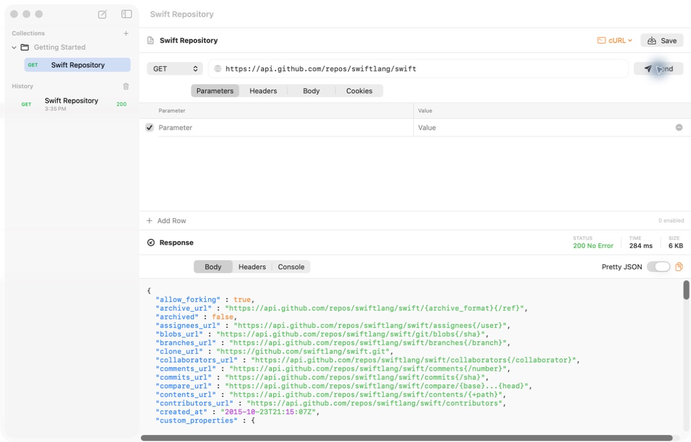

  

# PostIt

A native macOS client for creating, sending, and saving HTTP requests.

## Features

- Create requests with parameters, headers, cookies, and common body formats.
- Import cURL commands or copy a request as cURL.
- View formatted response bodies, headers, timing, size, and the raw exchange.
- Save requests in collections and review the request history.
- Receive signed updates in the app.

## Installation

PostIt requires macOS 26 or later.

1. Download the latest disk image from [GitHub Releases](https://github.com/mbokinala/PostIt/releases/latest).
2. Open the disk image.
3. Drag PostIt to the Applications folder.
4. Open PostIt from the Applications folder.

PostIt checks for updates automatically. You can also select **PostIt > Check for Updates**.

## Build from source

1. Clone this repository.
2. Open `PostIt.xcodeproj` in Xcode.
3. Select the PostIt scheme.
4. Build and run the app.
